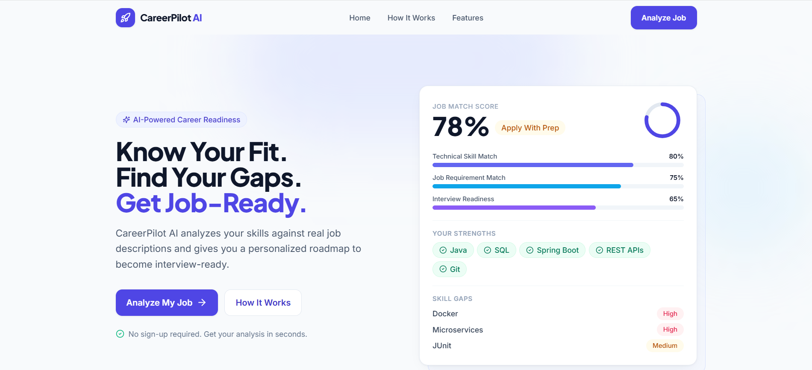
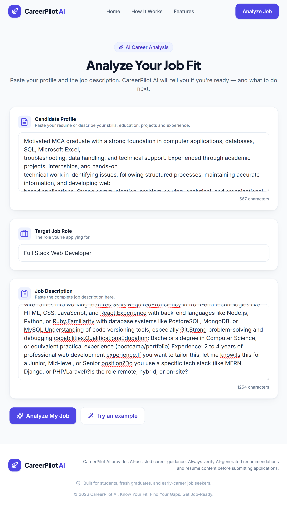
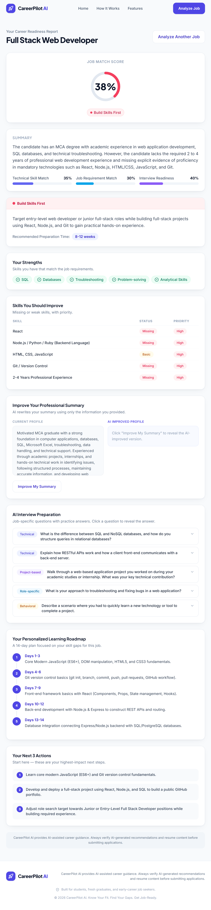
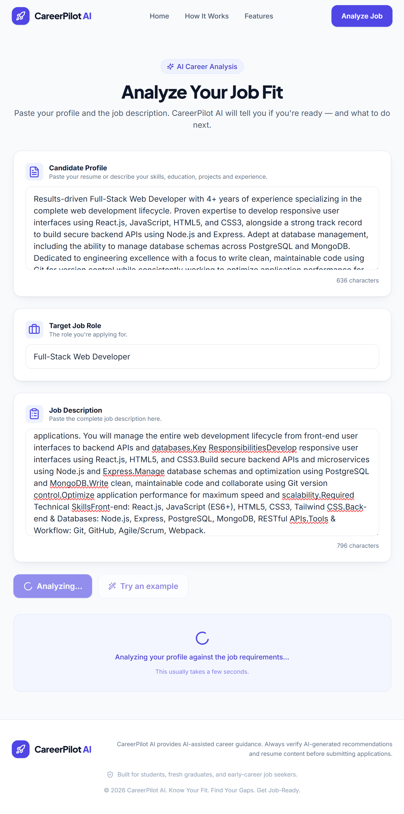
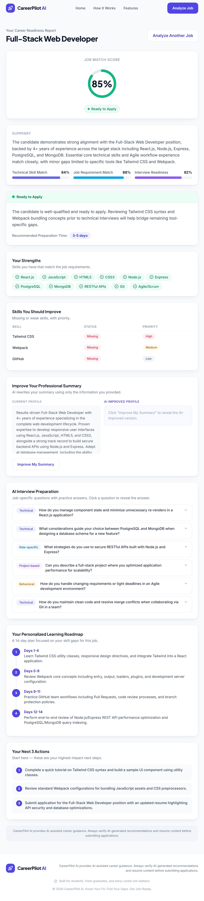
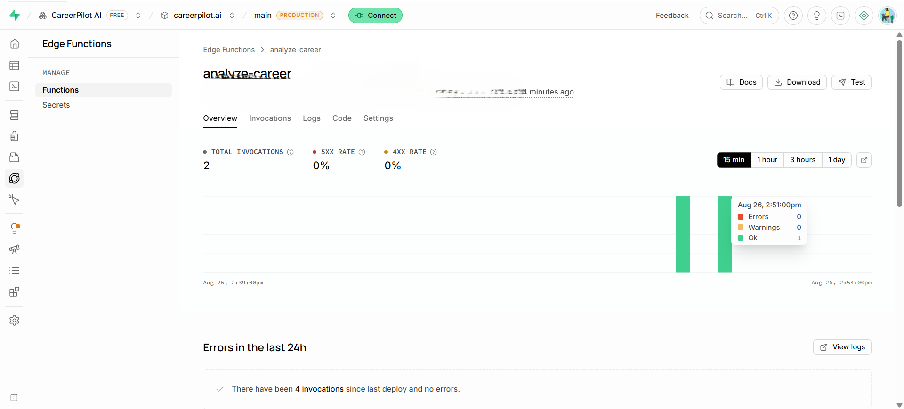

# CareerPilot AI
---
An AI-powered career readiness platform that analyses a candidate's profile against a target job description and provides personalized readiness insights, users Strengths, skill gaps, interview preparation, and a learning roadmap.The main goal of this project is to help candidates understand where they currently stand and what they should improve before applying for a job.

My contribution was mainly in taking the AI-generated application and making it work as a complete application. I handled the Supabase setup, Edge Function configuration, Gemini API integration, environment variables, API key security, testing, and debugging. I also worked through the errors that came up during development instead of depending only on the AI builder.

---

## Probelm Statement

As a fresher, I know that one of the confusing parts of job preparation is understanding what to learn for a specific role!

Many students and freshers apply for jobs without knowing how closely their current skills match the job requirements.

A job description can contain:

- Technical skills
- Tools and frameworks
- Experience requirements
- Role-specific knowledge
- Interview expectations

It can be difficult to go through all of these requirements manually and create a clear preparation plan.

So, I wanted to build something that could take a candidate's profile and a job description and give a simple, useful analysis.
Instead of giving a generic list of skills, I wanted CareerPilot AI to focus on the gap between:

### Goal

What I currently know + What the job requires = What I should prepare next

---

## Solution

CareerPilot AI is an AI-powered career readiness platform that helps candidates understand their readiness for a specific job.

The user provides their candidate profile and a target job description. CareerPilot AI analyzes both and generates a personalized career readiness report.

The report includes:
•	Job match score
•	Readiness level
•	Matching skills
•	Skill gaps
•	Technical skill match
•	Requirement match
•	Interview readiness
•	Improved professional summary
•	Interview questions
•	14-day learning roadmap
•	Recommended next actions

Instead of only telling the candidate whether they match a job, the application tries to answer the more useful question:

**What should I do next to become more prepared for this job?**

---

## Technologies Used

### Frontend

- React
- TypeScript
- Vite
- Tailwind CSS

### Backend / AI

- Supabase Edge Functions
- Google Gemini API
- Gemini 3.6 Flash

### Development Tools

- Bolt.new
- Visual Studio Code
- Git
- GitHub
- Supabase CLI
- done
- versel for Deployment

---

## WorkFlow

> User clicks The Analyze Job

>> Enter's Candidate Profile

>> Enter's Target Job + Job Description

>>> CareerPilot AI & MVP (React & TypeScript & Tailwind CSS)

>>> Supabase Edge Function acts As a Backend Layer

>>> analyze-career Edge Function securely communicates with Gemini API

>>> Gemini API key is stored as a Supabase secret instead of exposing it in the frontend

>>> Gemini 3.6 Flash API Analyzes the candidate profile & Generates the report

>>>> AI Career Analysis

>>>>> Match Score

>>>>> Skill Gaps

>>>>> Readiness

>>>>> Interview Questions

>>>>> 14 Day Learning Roadmap

>>>>> Next Actions

---

## Screenshots

### Test Case-1:

**AI Report**

### Test Case-2:

**AI Report**

### Supabase Project report

---

## Individual Contribution

I worked on the project individually.

My contribution included both the application development and the technical integration required to make the prototype work.
In particular, I worked on:
- Application development using an AI Builder
- Frontend structure and user flow
- Supabase configuration
- Edge Function setup
- Gemini API integration
- Environment variable configuration
- API key security
- Testing

## Future Improvements

There are several features I would like to add after the MVP:

- Resume PDF upload and analysis
- Resume vs job description comparison
- Multiple job comparison
- Personalized interview practice
- AI-powered resume improvement
- Job application tracking
- Personalized study schedules
- Progress tracking

These features are planned for future versions. The current submission focuses on the core AI-powered career readiness analysis.

## Author

**Pallavi Ande**

**MCA Graduate | Java Full Stack Developer | Web Developer**

Interested in building practical applications using Java, Spring Boot, React, databases, and AI technologies.
